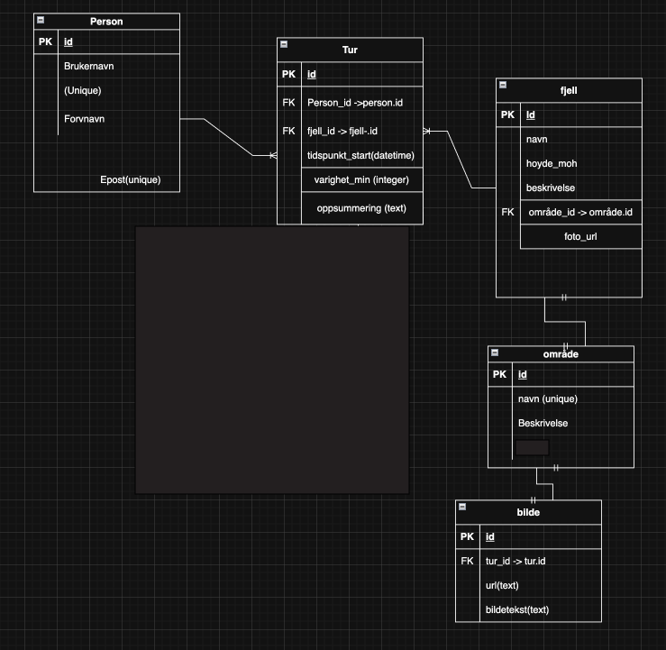

På denne appen skal kunne følgende: 
	•	Se liste over fjellturer
	•	Legge til ny tur
	•	Se detaljside for én tur
	•	Redigere tur
	•	Slette tur

Her er datamodellen:

Her er en av spørringene jeg kjørte for å skjekke at "JOIN" fungerte: 

SELECT
    t.id,
    p.brukernavn,
    f.navn AS fjellnavn,
    t.tidspunkt_start,
    t.varighet_min,
    t.oppsummering
FROM tur t
JOIN person p ON t.person_id = p.id
JOIN fjell f ON t.fjell_id = f.id;

Denne spørringen kobler tabellene tur, person og fjell for å vise hvem som har gått hvilken tur.